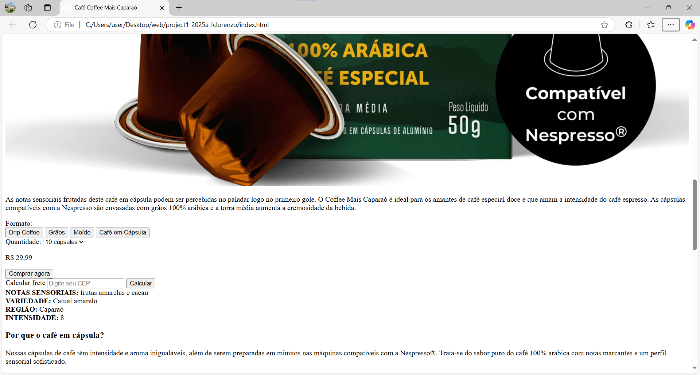

# Projeto: Remake estático de página web

Acesso:
<https://elc1090.github.io/project1-2025a-fclorenzo/>

## Desenvolvedor(a)

Lorenzo Comunello (Sistemas de Informação)

## Cliente

Andressa Teixeira (Sistemas para Internet)

## Site/app original

### Link

<https://coffeemais.com/products/cafe-caparao-capsula-10-unid>

### Descrição

Este projeto é um remake de uma página de uma loja de cafés, com foco na venda de cápsulas de café Coffee Mais Caparaó. A página original apresenta a descrição dos produtos, opções de compra, e informações sobre os cafés. O remake manteve a estrutura principal, mas com melhorias no design e funcionalidades para torná a página  responsiva e visualmente mais atrativa, utilizando o Tailwind CSS para personalizar o layout.

## Demanda do(a) cliente

O cliente solicitou um remake da página original, mantendo a proposta de venda de cápsulas de café, mas com algumas melhorias de design, incluindo:

- Criar uma interface simples para o cálculo de frete e opções de compra.
- Adicionar um layout mais clean e profissional, sem sobrecarregar o visual.
- Rearranjar certos elementos da página.
- Retirar a menção ao programa de assinantes da plataforma do conteúdo principal sobre o produto.

## Desenvolvimento

O desenvolvimento foi focado em:

- Recriar a estrutura do site: Utilizando HTML e Tailwind CSS para garantir um design simples e flexível.
- Responsividade: O site foi otimizado para ser responsivo, utilizando as classes `sm:`, `md:`, e `lg:` do Tailwind CSS.
- Acessibilidade: Foi adicionado um link para "Pular para o conteúdo" com a tecla de atalho `Alt + C`, e o tema escuro foi implementado utilizando as classes `dark:` do Tailwind.
- Melhoria na navegação: O layout foi simplificado para uma navegação mais fluida, com botões e inputs claros para interação com o usuário.
- Remake visual: A interface foi adaptada para um estilo mais clean, utilizando as cores e formas proporcionadas pelo Tailwind, mantendo a essência do site original.

## Tecnologias

- HTML: Estruturação do conteúdo.
- CSS (Tailwind): Utilizado para estilizar o site e garantir que o design fosse responsivo e personalizável.
- GitHub Pages: Utilizado para hospedar o projeto e visualizá-lo online.

## Ambiente de desenvolvimento

- VS Code: Editor de código utilizado para o desenvolvimento.
- Live Server: Extensão do VS Code utilizada para visualizar o projeto em tempo real durante o desenvolvimento.
-Microsoft Edge: para testar a página final.
- Git: Para versionamento do código e controle de alterações.

## Referências e créditos

- Tailwind CSS: Framework utilizado para facilitar o design responsivo e personalizável. Documentação: [https://tailwindcss.com/docs](https://tailwindcss.com/docs)
- Site Original: <https://coffeemais.com/products/cafe-caparao-capsula-10-unid>
- GitHub Pages: Para hospedagem do projeto: [https://pages.github.com/](https://pages.github.com/)

---
Projeto entregue para a disciplina de [Desenvolvimento de Software para a Web](http://github.com/andreainfufsm/elc1090-2025a) em 2025a
